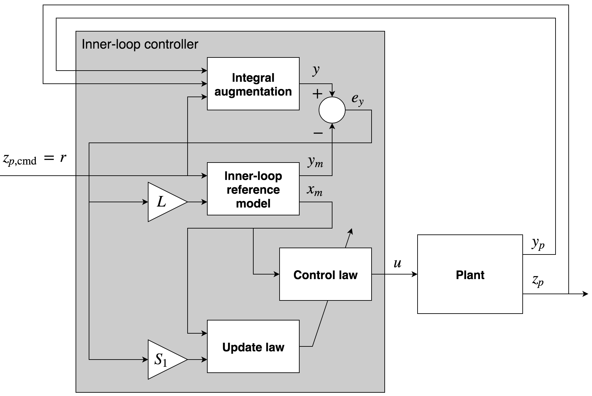
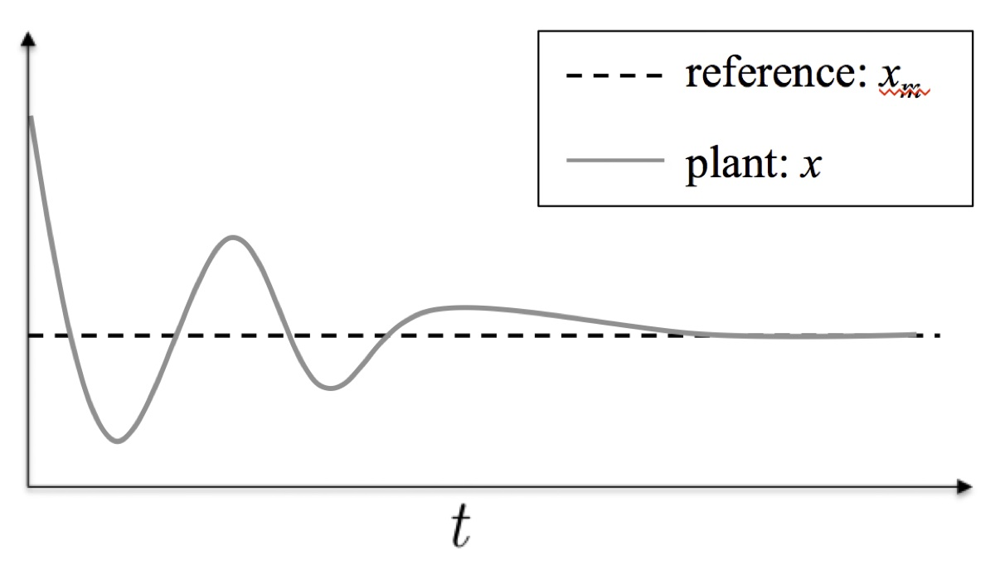
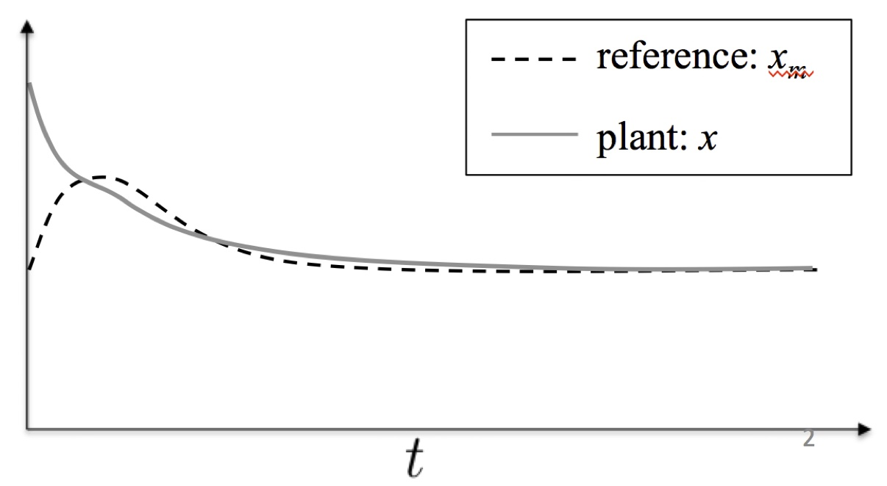

# About Me

- Test
- More Stuff

# Significant Accomplishments

<ul>
<li class="fragment" data-fragment-index="1" style="font-weight: bold; margin-bottom: 30px;">Completing a PhD in mechanical engineering at MIT</li>
<ul>
<li class="fragment" data-fragment-index="2">Learned fundamental skills to think deeply, solve difficult problems, and communicate</li>
</ul>
<li class="fragment" data-fragment-index="3" style="font-weight: bold; margin-bottom: 30px; margin-top: 30px;">Founding and selling Humon</li>
<ul>
<li class="fragment" data-fragment-index="4">Learned a career's worth of skills in 3.5 years</li>
<li class="fragment" data-fragment-index="5">Hardware/software engineering, manufacturing, fundraising, IP</li>
</ul>
<li class="fragment" data-fragment-index="6" style="font-weight: bold; margin-top: 30px;">Leading R&D at Whoop</li>
<ul>
<li class="fragment" data-fragment-index="7">Hired and led a team of outstanding engineers and scientists</li>
<li class="fragment" data-fragment-index="8">Produced excellent outcomes and maintained great eNPS</li>
</ul>
</ul>

# Airbreathing Hypersonic Vehicles: Control Challenges

<ul>
<li class="fragment" data-fragment-index="2" style="font-weight: bold; margin-bottom: 30px;">Highly open-loop unstable</li>
<li class="fragment" data-fragment-index="3" style="font-weight: bold; margin-bottom: 30px;">Difficult to model</li>
<ul>
<li class="fragment" data-fragment-index="4">Poor CFD models</li>
<li class="fragment" data-fragment-index="5">Limited wind tunnel data</li>
<li class="fragment" data-fragment-index="6">Complex shock interactions</li>
</ul>
<li class="fragment" data-fragment-index="7" style="font-weight: bold; margin-bottom: 30px; margin-top: 30px;">Must operate over a large flight envelope</li>
<ul>
<li class="fragment" data-fragment-index="8">Largely varying dynamic pressure</li>
</ul>
<li class="fragment" data-fragment-index="9" style="font-weight: bold; margin-bottom: 30px; margin-top: 30px;">Aerodynamic and propulsive coupling</li>
<ul>
<li class="fragment" data-fragment-index="10">Unstart can create abrupt changes to moments</li>
</ul>
<li class="fragment" data-fragment-index="11" style="font-weight: bold; margin-bottom: 30px; margin-top: 30px;">Unable to accurately obtain incidence angle measurements</li>
</ul>

<!-- https://blog.pointwise.com/2018/06/15/this-week-in-cfd-317/ -->

# Problem Statement

Design a controller for a hypersonic vehicle that can

<ul>
<li class="fragment" data-fragment-index="2" style="margin-bottom: 30px;">Accommodate high levels of <b>model uncertainty</b></li>
<li class="fragment" data-fragment-index="3" style="margin-bottom: 30px;">Be <b>robust</b> to delays and unmodeled dynamics</li>
<li class="fragment" data-fragment-index="4" style="margin-bottom: 30px;">Enable <b>agressive maneuvering</b></li>
<li class="fragment" data-fragment-index="5" style="margin-bottom: 30px;"><b>Avoid unstart</b></li>
<li class="fragment" data-fragment-index="6" style="margin-bottom: 30px;">Ensure satisfactory <b>command tracking</b></li>
</ul>

# Plant Overview

<ul>
<li class="fragment" data-fragment-index="1" style="margin-bottom: 30px;">The Generic Hypersonic Vehicle model is a variant of the HiFIRE 6 vehicle</li>
<li class="fragment" data-fragment-index="3" style="margin-bottom: 30px;">Equations of motion are standard flat-earth, nonlinear 12-state, 6-DOF equations</li>
<ul>
<li class="fragment" data-fragment-index="4" style="margin-bottom: 30px;">No rotating turbomachinery terms or fuel sloshing, vehicle is a rigid body</li>
</ul>
</ul>

<table class="fragment" data-fragment-index="2" style="font-size:0.7em;">
  <tr>
    <th>Parameter</th>
    <th>Unit</th>
    <th>Value</th>
  </tr>
  <tr>
    <td>Gross weight</td>
    <td>[lbm]</td>
    <td>1220.3</td>
  </tr>
  <tr>
    <td>Empty weight</td>
    <td>[lbm]</td>
    <td>993.3</td>
  </tr>
  <tr>
    <td>Vehicle length</td>
    <td>[in]</td>
    <td>175.9</td>
  </tr>
  <tr>
    <td>Span</td>
    <td>[in]</td>
    <td>58.6</td>
  </tr>
  <tr>
    <td>Nose diameter</td>
    <td>[in]</td>
    <td>11.0</td>
  </tr>
  <tr>
    <td>Tail diameter</td>
    <td>[in]</td>
    <td>18.8</td>
  </tr>
</table>

# Simplified Model for Controller Synthesis

<section>

<ul>
<li class="fragment" data-fragment-index="1" style="margin-bottom: 30px;">Linearize the 12-state model about a desired trim condition</li>
</ul>

\begin{equation*}
  f(X,U)= f(X_{\text{eq}},U_{\text{eq}})+\left.\frac{\partial{}f(X,U)}{\partial{}X}\right|_{\text{eq}}x+\left.\frac{\partial{}f(X,U)}{\partial{}U}\right|_{\text{eq}}u+\epsilon
\end{equation*}

<ul>
<ul>
<li class="fragment" data-fragment-index="2" style="margin-bottom: 30px;">Validate linearity assumption</li>
</ul>
<li class="fragment" data-fragment-index="3" style="margin-bottom: 30px;">Decouple 12-state <i>linear model</i> into several lower-order models</li>
<ul>
<li class="fragment" data-fragment-index="4" style="margin-bottom: 30px;">Velocity, longitudinal, lateral-directional dynamics</li>
</ul>
<li class="fragment" data-fragment-index="5" style="margin-bottom: 30px;">Further simplify models by removing navigation and orientation dynamics</li>
<li class="fragment" data-fragment-index="6" style="margin-bottom: 30px;">These three linear inner-loop subsystems are represented by linear models </li>
</ul>

\begin{equation*}
  \begin{split}
    \dot{x}_{p}(t)&=A_{p}x_{p}(t)+B_{p}u(t) \\
    y_{p}(t)&=C_{p}x_{p}(t) \\
    z_{p}(t)&=C_{pz}x_{p}(t)+D_{pz}u(t)
  \end{split}
\end{equation*}

</section>

<section>

<ul>
<li class="fragment" data-fragment-index="1" style="margin-bottom: 30px;">The sensitivity matrix allows comparison of modes across state variables whose units differ</li>
</ul>

</section>

<section>

<ul>
<li class="fragment" data-fragment-index="1" style="margin-bottom: 30px;">The model exhibits decoupling between longitudinal, lateral-directional, dynamics</li>
</ul>

</section>

# Inner-Loop Plant Models

<section>

<ul>
<li class="fragment" data-fragment-index="1" style="margin-bottom: 30px;">Introduce the linear <i>uncertain</i> plant model</li>
</ul>

\begin{equation*}
  \begin{split}
    \dot{x}(t)&=(A+B\Psi^{\top})x(t)+B\Lambda u(t)+B_{\text{cmd}}z_{\text{cmd}}(t) \\
    y(t)&=Cx(t)
  \end{split}
\end{equation*}

where &nbsp;$\Lambda$&nbsp; and &nbsp;$\Psi$&nbsp; are unknown

<ul>
<li class="fragment" data-fragment-index="2" style="margin-bottom: 30px;">This model adds integral control on the <i>regulated output</i> and includes model uncertainty</li>
<li class="fragment" data-fragment-index="3" style="margin-bottom: 30px;">$u$&nbsp; is the input and &nbsp;$z_{\text{cmd}}$&nbsp; is the command</li>
<li class="fragment" data-fragment-index="4" style="margin-bottom: 30px;">Some comments</li>
<ul>
<li class="fragment" data-fragment-index="5" style="margin-bottom: 30px;">Uncertainty enters through the columns of &nbsp;$B$&nbsp;</li>
<li class="fragment" data-fragment-index="6" style="margin-bottom: 30px;">No direct feedthrough of the control to output</li>
</ul>
</ul>

</section>

<section>

## Model Construction

\begin{align}
  \dot{x}_{p}(t) &= A_{p}x_{p}(t) + B_{p}\bigr(\Lambda u(t) + \Psi_{p}^{\top}x_{p}(t)\bigr) \\
  y_{p}(t) &= C_{p}x_{p}(t) \\
  z_{p}(t) &= C_{pz}x_{p}(t) + D_{pz}\bigr(\Lambda u(t) + \Psi_{p}^{\top}x_{p}(t)\bigr) \\
\end{align}

\begin{equation*}
  \begin{gathered}
    A=
    \begin{bmatrix}
      A_{p} & 0_{n_{p}\times n_{e}} \\
      -C_{pz} & 0_{n_{e}\times n_{e}}
    \end{bmatrix} \quad
    B=
    \begin{bmatrix}
      B_{p} \\
      -D_{pz}
    \end{bmatrix}
    \quad
    B_{\text{cmd}}=
    \begin{bmatrix}
      0_{n_{p}\times m} \\
      I_{n_{e}\times n_{e}}
    \end{bmatrix} \\
    C=
    \begin{bmatrix}
      C_{p} & 0_{\ell\times n_{e}} \\
      0_{n_{e}\times n_{p}} & I_{n_{e}\times n_{e}}
    \end{bmatrix}
    \quad
    C_{z} =
    \begin{bmatrix}
      C_{pz} & 0
    \end{bmatrix}
  \end{gathered}
\end{equation*}

\begin{equation*}
  \begin{split}
    \dot{x}(t)&=(A+B\Psi^{\top})x(t)+B\Lambda u(t)+B_{\text{cmd}}z_{\text{cmd}}(t) \\
    y(t)&=Cx(t)
  \end{split}
\end{equation*}

</section>

# Assumptions

\begin{equation*}
  \begin{split}
    \dot{x}(t)&=(A+B\Psi^{\top})x(t)+B\Lambda u(t)+B_{\text{cmd}}z_{\text{cmd}}(t) \\
    y(t)&=Cx(t)
  \end{split}
\end{equation*}

<ul>
<li class="fragment" data-fragment-index="1" style="margin-bottom: 30px;">$(A, B)$&nbsp; is controllable</li>
<li class="fragment" data-fragment-index="2" style="margin-bottom: 30px;">$(A, C)$&nbsp; is observable</li>
<li class="fragment" data-fragment-index="3" style="margin-bottom: 30px;">$B,\;C,\;CB$&nbsp; are full rank</li>
<li class="fragment" data-fragment-index="4" style="margin-bottom: 30px;">Zeros of &nbsp;$(A,\;B,\;C,\;0)$&nbsp; are strictly stable</li>
<li class="fragment" data-fragment-index="5" style="margin-bottom: 30px;">$\Lambda$&nbsp; is a nonsingular, diagonal matrix with entries of known sign</li>
<li class="fragment" data-fragment-index="6" style="margin-bottom: 30px;">$\|\Psi\|<\Psi_{\text{max}}<\infty$&nbsp; where &nbsp;$\Psi_{\text{max}}$&nbsp; is known</li>
</ul>

# Notes on Assumptions

<ul>
<li class="fragment" data-fragment-index="1" style="margin-bottom: 30px;">Controllability and observability are standard assumptions satisfied for vehicle models such as the above</li>
<li class="fragment" data-fragment-index="2" style="margin-bottom: 30px;">Full rank of &nbsp;$B,\;C,\;CB$&nbsp; implies that inputs and outputs are not redundant, and the MIMO equivalent of relative degree one</li>
<li class="fragment" data-fragment-index="3" style="margin-bottom: 30px;">Strict stability (minimum phase) of zeros is straightforward to satisfy for vehicle models such as the above</li>
<li class="fragment" data-fragment-index="4" style="margin-bottom: 30px;">Sign of &nbsp;$\Lambda$&nbsp; known indicates no control reversal</li>
<ul>
<li class="fragment" data-fragment-index="5" style="margin-bottom: 30px;">Diagonal structure indicates loss of control effectiveness</li>
</ul>
<li class="fragment" data-fragment-index="6" style="margin-bottom: 30px;">The bound &nbsp;$\Psi_{\text{max}}$&nbsp; need not be tight, and in practice can be easily selected</li>
</ul>

# Controller Synthesis

<ul>
<li class="fragment" data-fragment-index="1" style="margin-bottom: 30px;">Introduce the reference model</li>
</ul>

\begin{equation*}
  \begin{split}
    \dot{x}_{m}(t)&=A_{m}x_{m}(t)+B_{\text{cmd}} r(t)+L(y_{m}(t)-y(t)) \\
    y_{m}(t)&=Cx_{m}(t)
  \end{split}
\end{equation*}

<ul>
<li class="fragment" data-fragment-index="3" style="margin-bottom: 30px;">Propose the following controller</li>
</ul>

\begin{equation*}
  \begin{split}
  u(t)&=(K+\Theta(t))^{\top}x_{m}(t) \\
  \dot{\Theta}(t)&=-\Gamma x_{m}(t)(S_{1}e_{y}(t))^{\top}\text{sgn}(\Lambda)
  \end{split}
\end{equation*}

<ul>
<li class="fragment" data-fragment-index="5" style="margin-bottom: 30px;">Stability of the closed-loop system must be shown</li>
<li class="fragment" data-fragment-index="6" style="margin-bottom: 30px;"><b>The control goal is to select the control gains such that $z_{p}$ tracks $z_{\text{cmd}}$</b></li>
</ul>

# Comments on the Closed-Loop System

\begin{equation*}
  \begin{split}
    \dot{x}(t)&=(A+B\Psi^{\top})x(t)+B\Lambda u(t)+B_{\text{cmd}}z_{\text{cmd}}(t) \\
    y(t)&=Cx(t) \\
    \dot{x}_{m}(t)&=A_{m}x_{m}(t)+B_{\text{cmd}} r(t)+L(y_{m}(t)-y(t)) \\
    y_{m}(t)&=Cx_{m}(t) \\
    u(t)&=(K+\Theta(t))^{\top}x_{m}(t) \\
    \dot{\Theta}(t)&=-\Gamma x_{m}(t)(S_{1}e_{y}(t))^{\top}\text{sgn}(\Lambda)
  \end{split}
\end{equation*}

<ul>
<li class="fragment" data-fragment-index="1" style="margin-bottom: 30px;">Output feedback: control depends on &nbsp;$y$&nbsp; only</li>
<li class="fragment" data-fragment-index="2" style="margin-bottom: 30px;">With $\Theta$,&nbsp;$\dot{\Theta}=0$&nbsp; <b>architecturally this is just an LQG controller</b></li>
<li class="fragment" data-fragment-index="3" style="margin-bottom: 30px;">Control designer must select &nbsp;$\Gamma$&nbsp;, &nbsp;$S_{1}$&nbsp;, and &nbsp;$L$&nbsp;</li>
<ul>
<li class="fragment" data-fragment-index="4" style="margin-bottom: 30px;">$\Gamma=\Gamma^{\top}>0$</li>
<li class="fragment" data-fragment-index="5" style="margin-bottom: 30px;">The control task is to select &nbsp;$S_{1}$&nbsp; and &nbsp;$L$&nbsp; to guarantee stability</li>
</ul>
</ul>

# Inner-Loop Controller Block Diagram

# Selecting Controller (1)

<section>

<ul>
<li class="fragment" data-fragment-index="1" style="margin-bottom: 30px;">The error model that results from the proposed controller is</li>
</ul>

\begin{equation*}
  \begin{split}
    \dot{e}_{x}&=(A+LC+B\Psi^{\top})e_{x}+B\Lambda\tilde{\Theta}^{\top}x_{m} \\
    e_{y}&=Ce_{x} \\
    e_{s}&=S_{1}e_{y}
  \end{split}
\end{equation*}

<ul>
<li class="fragment" data-fragment-index="3" style="margin-bottom: 30px;">If &nbsp;$S_{1}$&nbsp; and &nbsp;$L$&nbsp; can be chosen such that the error model is SPR, stability follows</li>
<li class="fragment" data-fragment-index="4" style="margin-bottom: 30px;">Applying the Kalman–Yakubovic Lemma, the above error dynamics are SPR if</li>
</ul>

\begin{equation*}
  \begin{split}
    &(A+LC)^{\top}P+P(A+LC)+Q<0 \\
    &PB=(S_{1}C)^{\top}
  \end{split}
\end{equation*}

<ul>
<li class="fragment" data-fragment-index="5" style="margin-bottom: 30px;">$Q$&nbsp; is chosen based on &nbsp;$\Psi_{\text{max}}$&nbsp;</li>
<li class="fragment" data-fragment-index="6" style="margin-bottom: 30px;">$X=X^{\top}>0$&nbsp; is arbitrary and &nbsp;$B^{\perp}$&nbsp; is an annhiliator matrix that satisfies &nbsp;$B^{\top}B^{\perp}=0$</li>
<li class="fragment" data-fragment-index="7" style="margin-bottom: 30px;">A &nbsp;$P$&nbsp; satisfying the inequality exists if, and only if, &nbsp;$S_{1}CB=(S_{1}CB)^{\top}$</li>
</ul>

</section>

<section>

<ul>
<li class="fragment" data-fragment-index="1" style="margin-bottom: 30px;">The statement of strict positive realness</li>
</ul>

</section>

# Selecting Controller (2)

<section>

<ul>
<li class="fragment" data-fragment-index="1" style="margin-bottom: 30px;">One choice of &nbsp;$S_{1}$&nbsp; is the generalized left-inverse of &nbsp;$CB$&nbsp; as follows</li>
</ul>

\begin{equation*}
  S_{1}=((CB)^{\top}CB)^{-1}(CB)^{\top}
\end{equation*}

<ul>
<li class="fragment" data-fragment-index="3" style="margin-bottom: 30px;">This choice of &nbsp;$S_{1}$&nbsp; ensures a &nbsp;$P$&nbsp; satisfying $(A+LC)^{\top}P+P(A+LC)+Q<0$ exists given by</li>
</ul>

\begin{equation*}
  P=C^{\top}(CB)^{-\top}C+B^{\perp}XB^{\perp\top}
\end{equation*}

<ul>
<li class="fragment" data-fragment-index="4" style="margin-bottom: 30px;">We now have to solve a bilinear matrix inequality in &nbsp;$L$&nbsp; and &nbsp;$P$&nbsp; (or equivalently &nbsp;$X$)</li>
<li class="fragment" data-fragment-index="5" style="margin-bottom: 30px;">Using the Matrix Elimination Lemma, an &nbsp;$L$&nbsp; satisfying the inequality exists if, and only if, a &nbsp;$P$&nbsp; satisfies</li>
</ul>

\begin{equation*}
  M^{\top}(A^{\top}P+PA)M<-M^{\top}QM
\end{equation*}

<ul>
<li class="fragment" data-fragment-index="6" style="margin-bottom: 30px;">Using &nbsp;$P$&nbsp; above gives the following, where the existence of &nbsp;$X>0$&nbsp; is guaranteed</li>
</ul>

\begin{equation*}
  (NAM)^{\top}XNM+(NM)^{\top}X(NAM)<-M^{\top}QM
\end{equation*}

</section>

<section>

<ul>
<li class="fragment" data-fragment-index="1" style="margin-bottom: 30px;">Note: &nbsp;$M$&nbsp; represents a particular annhilator &nbsp;$C^{\top\perp}$&nbsp; and &nbsp;$N$&nbsp; a particular &nbsp;$B^{\perp\top}$&nbsp; such that &nbsp;$NB=0$&nbsp; and &nbsp;$CM=0$.</li>
</ul>

</section>

# Selecting Controller (3)

<ul>
<li class="fragment" data-fragment-index="1" style="margin-bottom: 30px;"><b>The problem of finding $L$ and $X$ that satisfy a BMI is now reduced to finding $X$ (whose existence is guaranteed) satisfying an LMI</b></li>
<li class="fragment" data-fragment-index="2" style="margin-bottom: 30px;">The solutions &nbsp;$X$&nbsp; are given analytically thus specifying &nbsp;$P$</li>
</ul>

\begin{equation*}
  P=C^{\top}(CB)^{-\top}C+B^{\perp}XB^{\perp\top}
\end{equation*}

<ul>
<li class="fragment" data-fragment-index="3" style="margin-bottom: 30px;">This &nbsp;$P$&nbsp; then reduces the following to a feasible LMI in &nbsp;$L$</li>
</ul>

\begin{equation*}
  (A+LC)^{\top}P+P(A+LC)+Q<0
\end{equation*}

<ul>
<li class="fragment" data-fragment-index="4" style="margin-bottom: 30px;"><b>This control synthesis process involves a few steps of matrix algebra, and provides a guaranteed-stable closed-loop system with sufficient degrees of freedom that can be leveraged to improve the robustness proprties of the baseline controller</b></li>
</ul>

# Inner-Loop Controller

<ul>
<li class="fragment" data-fragment-index="1" style="margin-bottom: 30px;">TBD</li>
</ul>

# Comments on Closed-Loop Reference Model

<ul>
<li class="fragment" data-fragment-index="1" style="margin-bottom: 30px;">The closed-loop reference model provides beneficial properties, especially with regards to transient behavior</li>
</ul>

