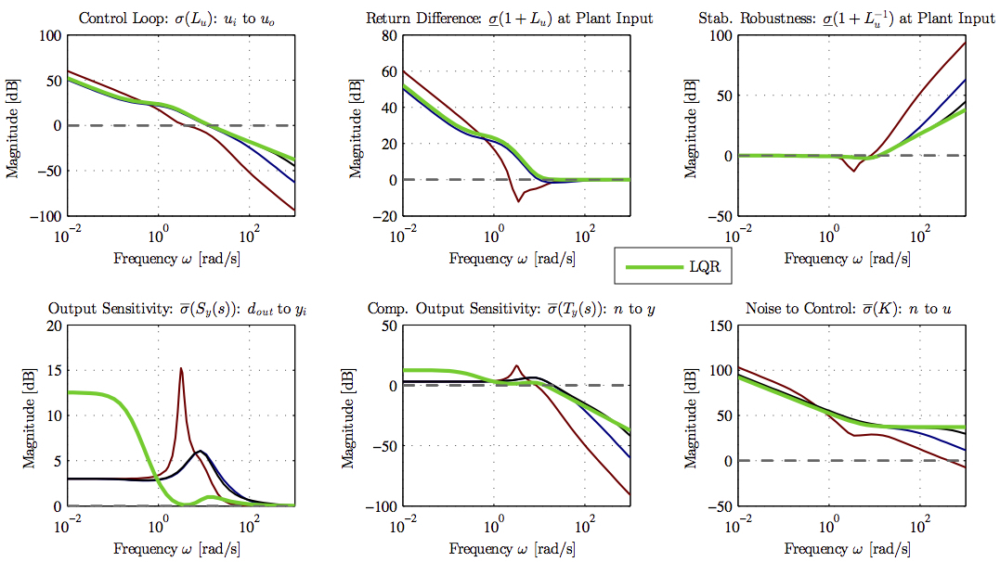

<!--
decktape -s 1600x1000 --screenshots file:///Users/dpwiese/Code/dpwiese/blue-origin-slides/src/main.html out.pdf
-->

# About Me

<ul>
<li class="fragment" data-fragment-index="1" style="margin-bottom: 30px;">Mechanical/aerospace engineer by training</li>
<li class="fragment" data-fragment-index="2" style="margin-bottom: 30px;">Expert problem solver, with experience across a wide breadth of technical domains</li>
<li class="fragment" data-fragment-index="3" style="margin-bottom: 30px;">Experienced hands-on manager, leading teams to excellent outcomes regardless of technology stack</li>
</ul>

# Significant Accomplishments

<ul>
<li class="fragment" data-fragment-index="1" style="font-weight: bold; margin-bottom: 30px;">Completing a PhD in mechanical engineering at MIT</li>
<ul>
<li class="fragment" data-fragment-index="2">Developed new heirarchical approach to adaptive output feedback control</li>
<li class="fragment" data-fragment-index="3">Learned fundamental skills to think deeply, solve difficult problems, and communicate</li>
</ul>
<li class="fragment" data-fragment-index="4" style="font-weight: bold; margin-bottom: 30px; margin-top: 30px;">Founding, running, and selling Humon</li>
<ul>
<li class="fragment" data-fragment-index="5">Hardware/software engineering, signal processing and data science, manufacturing, IP, supply chain, and more</li>
<li class="fragment" data-fragment-index="6">Learned a career's worth of skills in 3.5 years</li>
</ul>
<li class="fragment" data-fragment-index="7" style="font-weight: bold; margin-top: 30px;">Leading R&D at Whoop</li>
<ul>
<li class="fragment" data-fragment-index="8">Hired and led a team of high-performing, multidisciplinary engineers and scientists</li>
<li class="fragment" data-fragment-index="9">Drove excellent outcomes while maintaining leading eNPS</li>
</ul>
</ul>

# Section 2: Technical Presentation

<h1 style="display:block; margin-top:40vh">Section 2: Technical Presentation</h1>

# Airbreathing Hypersonic Vehicles: Control Challenges

<ul>
<li class="fragment" data-fragment-index="2" style="font-weight: bold; margin-bottom: 30px;">Highly open-loop unstable</li>
<li class="fragment" data-fragment-index="3" style="font-weight: bold; margin-bottom: 30px;">Difficult to model</li>
<ul>
<li class="fragment" data-fragment-index="4">Poor CFD models</li>
<li class="fragment" data-fragment-index="5">Limited wind tunnel data</li>
<li class="fragment" data-fragment-index="6">Complex shock interactions</li>
</ul>
<li class="fragment" data-fragment-index="7" style="font-weight: bold; margin-bottom: 30px; margin-top: 30px;">Must operate over a large flight envelope</li>
<ul>
<li class="fragment" data-fragment-index="8">Largely varying dynamic pressure</li>
</ul>
<li class="fragment" data-fragment-index="9" style="font-weight: bold; margin-bottom: 30px; margin-top: 30px;">Aerodynamic and propulsive coupling</li>
<ul>
<li class="fragment" data-fragment-index="10">Unstart can create abrupt changes to moments</li>
</ul>
<li class="fragment" data-fragment-index="11" style="font-weight: bold; margin-bottom: 30px; margin-top: 30px;">Unable to accurately obtain incidence angle measurements</li>
</ul>

<!-- https://blog.pointwise.com/2018/06/15/this-week-in-cfd-317/ -->

# Problem Statement

Design a controller for a hypersonic vehicle that can

<ul>
<li class="fragment" data-fragment-index="2" style="margin-bottom: 30px;">Accommodate high levels of <b>model uncertainty</b></li>
<li class="fragment" data-fragment-index="3" style="margin-bottom: 30px;">Be <b>robust</b> to delays and unmodeled dynamics</li>
<li class="fragment" data-fragment-index="4" style="margin-bottom: 30px;">Enable <b>agressive maneuvering</b></li>
<li class="fragment" data-fragment-index="5" style="margin-bottom: 30px;"><b>Avoid unstart</b></li>
<li class="fragment" data-fragment-index="6" style="margin-bottom: 30px;">Ensure satisfactory <b>command tracking</b></li>
</ul>

# Plant Overview (1)

<!--
GHV about 15 feet long with span of 5 feet
-->

<ul>
<li class="fragment" data-fragment-index="1" style="margin-bottom: 30px;">The Generic Hypersonic Vehicle model is a variant of the HiFIRE 6 vehicle</li>
<li class="fragment" data-fragment-index="3" style="margin-bottom: 30px;">Equations of motion are standard flat-earth, nonlinear 12-state, 6-DOF equations</li>
<ul>
<li class="fragment" data-fragment-index="4" style="margin-bottom: 30px;">No rotating turbomachinery terms or fuel sloshing, vehicle is a rigid body</li>
</ul>
</ul>

<table class="fragment" data-fragment-index="2" style="font-size:0.7em;">
  <tr>
    <th>Parameter</th>
    <th>Unit</th>
    <th>Value</th>
  </tr>
  <tr>
    <td>Gross weight</td>
    <td>[lbm]</td>
    <td>1220.3</td>
  </tr>
  <tr>
    <td>Empty weight</td>
    <td>[lbm]</td>
    <td>993.3</td>
  </tr>
  <tr>
    <td>Vehicle length</td>
    <td>[in]</td>
    <td>175.9</td>
  </tr>
  <tr>
    <td>Span</td>
    <td>[in]</td>
    <td>58.6</td>
  </tr>
  <tr>
    <td>Nose diameter</td>
    <td>[in]</td>
    <td>11.0</td>
  </tr>
  <tr>
    <td>Tail diameter</td>
    <td>[in]</td>
    <td>18.8</td>
  </tr>
</table>

# Plant Overview (2)

# Control Problem

 

# Simplified Model for Controller Synthesis

<section>

 
 

<ul>
<li class="fragment" data-fragment-index="1" style="margin-bottom: 30px;">The nonlinear equations of motion are <b>linearized</b></li>
<li class="fragment" data-fragment-index="2" style="margin-bottom: 30px;">Modal analysis is use to reduce the linear model into <b>several lower-order models</b></li>
<li class="fragment" data-fragment-index="3" style="margin-bottom: 30px;">The reduced linear models are <b>further partitioned</b></li>
<li class="fragment" data-fragment-index="4" style="margin-bottom: 30px;"><b>Uncertainty</b> manifests itself as shown above (more on this later)</li>
</ul>

</section>

<section>

<ul>
<li class="fragment" data-fragment-index="1" style="margin-bottom: 30px;">Linearize the 12-state model about a desired trim condition</li>
</ul>

\begin{equation*}
  f(X,U)= f(X_{\text{eq}},U_{\text{eq}})+\left.\frac{\partial{}f(X,U)}{\partial{}X}\right|_{\text{eq}}x+\left.\frac{\partial{}f(X,U)}{\partial{}U}\right|_{\text{eq}}u+\epsilon
\end{equation*}

<ul>
<ul>
<li class="fragment" data-fragment-index="2" style="margin-bottom: 30px;">Validate linearity assumption</li>
</ul>
<li class="fragment" data-fragment-index="3" style="margin-bottom: 30px;">Decouple 12-state <i>linear model</i> into several lower-order models</li>
<ul>
<li class="fragment" data-fragment-index="4" style="margin-bottom: 30px;">Velocity, longitudinal, lateral-directional dynamics</li>
</ul>
<li class="fragment" data-fragment-index="5" style="margin-bottom: 30px;">Further simplify models by removing navigation and orientation dynamics</li>
<li class="fragment" data-fragment-index="6" style="margin-bottom: 30px;">These three linear inner-loop subsystems are represented by linear models </li>
</ul>

\begin{equation*}
  \begin{split}
    \dot{x}_{p}(t)&=A_{p}x_{p}(t)+B_{p}u(t) \\
    y_{p}(t)&=C_{p}x_{p}(t) \\
    z_{p}(t)&=C_{pz}x_{p}(t)+D_{pz}u(t)
  \end{split}
\end{equation*}

</section>

<section>

<ul>
<li class="fragment" data-fragment-index="1" style="margin-bottom: 30px;">The sensitivity matrix allows comparison of modes across state variables whose units differ</li>
</ul>

</section>

<section>

<ul>
<li class="fragment" data-fragment-index="1" style="margin-bottom: 30px;">The model exhibits decoupling between longitudinal, lateral-directional, dynamics</li>
</ul>

</section>

# Why the Heirarchical Approach

<!--
Level 2 - Partial Automation
The vehicle has combined automated functions, such as acceleration and steering, but the driver must remain engaged with the driving task and monitor the environment at all times.
-->

<ul>
<li class="fragment" data-fragment-index="1" style="margin-bottom: 30px;">Leverage <b>existing knowledge</b> around how to design inner-loop controller</li>
<li class="fragment" data-fragment-index="2" style="margin-bottom: 30px;">Many systems require a "Level 2" inner-loop for <b>piloted vehicles</b></li>
<li class="fragment" data-fragment-index="3" style="margin-bottom: 30px;">Structure accommodates inner-loop <b>command limiting</b></li>
<li class="fragment" data-fragment-index="4" style="margin-bottom: 30px;">Control design for two small systems is easier than designing one controller for a <b>higher-order system</b></li>
<li class="fragment" data-fragment-index="5" style="margin-bottom: 30px;">In practice can produce <b>more robust control designs</b></li>
<li class="fragment" data-fragment-index="6" style="margin-bottom: 30px;">Facilitates using <b>different outer-loop</b> control structure with same inner-loop control law</li>
</ul>

# Inner-Loop Plant Models

<section>

<ul>
<li class="fragment" data-fragment-index="1" style="margin-bottom: 30px;">Introduce the linear <i>uncertain</i> plant model</li>
</ul>

\begin{equation*}
  \begin{split}
    \dot{x}(t)&=(A+B\Psi^{\top})x(t)+B\Lambda u(t)+B_{\text{cmd}}z_{\text{cmd}}(t) \\
    y(t)&=Cx(t)
  \end{split}
\end{equation*}

where &nbsp;$\Lambda$&nbsp; and &nbsp;$\Psi$&nbsp; are unknown

<ul>
<li class="fragment" data-fragment-index="2" style="margin-bottom: 30px;">This model adds integral control on the <i>regulated output</i> and includes model uncertainty</li>
<li class="fragment" data-fragment-index="4" style="margin-bottom: 30px;">Some comments</li>
<ul>
<li class="fragment" data-fragment-index="5" style="margin-bottom: 30px;">Uncertainty enters through the columns of &nbsp;$B$&nbsp;</li>
<li class="fragment" data-fragment-index="6" style="margin-bottom: 30px;">No direct feedthrough of the control to output</li>
</ul>
</ul>

</section>

<section>

## Model Construction

<ul>
<li class="fragment" data-fragment-index="1" style="margin-bottom: 30px;">That there is no feedthrough of the control to the output is common in aerospace systems</li>
<ul>
<li class="fragment" data-fragment-index="2" style="margin-bottom: 30px;">Control inputs create moments and angular velocities are measured</li>
<li class="fragment" data-fragment-index="3" style="margin-bottom: 30px;">One integration between input and output</li>
<li class="fragment" data-fragment-index="4" style="margin-bottom: 30px;">Direct feedthrough, as occurs when measuring linear accelerations, can be accommodated using fairly trivial modification to control design to follow</li>
</ul>
<li class="fragment" data-fragment-index="5" style="margin-bottom: 30px;">Uncertainty entering through control channels is reasonable given the uncertainty in moment coefficients in &nbsp;$A$</li>
</ul>

\begin{equation*}
  \begin{bmatrix}
    \dot{\alpha} \\
    \dot{q}
  \end{bmatrix}=
  \begin{bmatrix}
    0 & 1 \\
    M_{\alpha} & M_{q}
  \end{bmatrix}
  \begin{bmatrix}
    \alpha \\
    q
  \end{bmatrix}+
  \begin{bmatrix}
    0 \\
    M_{\delta_{e}}
  \end{bmatrix}
  \delta_{e}
\end{equation*}

</section>

<section>

## Model Construction

\begin{align}
  \dot{x}_{p}(t) &= A_{p}x_{p}(t) + B_{p}\bigr(\Lambda u(t) + \Psi_{p}^{\top}x_{p}(t)\bigr) \\
  y_{p}(t) &= C_{p}x_{p}(t) \\
  z_{p}(t) &= C_{pz}x_{p}(t) + D_{pz}\bigr(\Lambda u(t) + \Psi_{p}^{\top}x_{p}(t)\bigr) \\
\end{align}

\begin{equation*}
  \begin{gathered}
    A=
    \begin{bmatrix}
      A_{p} & 0_{n_{p}\times n_{e}} \\
      -C_{pz} & 0_{n_{e}\times n_{e}}
    \end{bmatrix} \quad
    B=
    \begin{bmatrix}
      B_{p} \\
      -D_{pz}
    \end{bmatrix}
    \quad
    B_{\text{cmd}}=
    \begin{bmatrix}
      0_{n_{p}\times m} \\
      I_{n_{e}\times n_{e}}
    \end{bmatrix} \\
    C=
    \begin{bmatrix}
      C_{p} & 0_{\ell\times n_{e}} \\
      0_{n_{e}\times n_{p}} & I_{n_{e}\times n_{e}}
    \end{bmatrix}
    \quad
    C_{z} =
    \begin{bmatrix}
      C_{pz} & 0
    \end{bmatrix}
  \end{gathered}
\end{equation*}

\begin{equation*}
  \begin{split}
    \dot{x}(t)&=(A+B\Psi^{\top})x(t)+B\Lambda u(t)+B_{\text{cmd}}z_{\text{cmd}}(t) \\
    y(t)&=Cx(t)
  \end{split}
\end{equation*}

</section>

# Assumptions

\begin{equation*}
  \begin{split}
    \dot{x}(t)&=(A+B\Psi^{\top})x(t)+B\Lambda u(t)+B_{\text{cmd}}z_{\text{cmd}}(t) \\
    y(t)&=Cx(t)
  \end{split}
\end{equation*}

<ul>
<li class="fragment" data-fragment-index="1" style="margin-bottom: 30px;">$(A, B)$&nbsp; is controllable</li>
<li class="fragment" data-fragment-index="2" style="margin-bottom: 30px;">$(A, C)$&nbsp; is observable</li>
<li class="fragment" data-fragment-index="3" style="margin-bottom: 30px;">$B,\;C,\;CB$&nbsp; are full rank</li>
<li class="fragment" data-fragment-index="4" style="margin-bottom: 30px;">Zeros of &nbsp;$(A,\;B,\;C,\;0)$&nbsp; are strictly stable</li>
<li class="fragment" data-fragment-index="5" style="margin-bottom: 30px;">$\Lambda$&nbsp; is a nonsingular, diagonal matrix with entries of known sign</li>
<li class="fragment" data-fragment-index="6" style="margin-bottom: 30px;">$\|\Psi\|<\Psi_{\text{max}}<\infty$&nbsp; where &nbsp;$\Psi_{\text{max}}$&nbsp; is known</li>
</ul>

# Notes on Assumptions

<!--
Control of plants with relative degree two is possible under additional assumptions
In the classical adaptive control, it is that the plant is diagonalizable via filters - that the ith input only affects the ith output
In modern MRAC output feedback adaptive control, that the plant uncertainty is independent from input uncertainty - no uncertainty is present through the relative degree two inputs
-->

<ul>
<li class="fragment" data-fragment-index="1" style="margin-bottom: 30px;">Controllability and observability are standard assumptions satisfied for vehicle models such as the above</li>
<li class="fragment" data-fragment-index="2" style="margin-bottom: 30px;">Full rank of &nbsp;$B,\;C,\;CB$&nbsp; implies that inputs and outputs are not redundant, and the MIMO equivalent of relative degree one</li>
<ul>
<li class="fragment" data-fragment-index="3" style="margin-bottom: 30px;">One integration between aerodynamic moments and angular rates</li>
</ul>
<li class="fragment" data-fragment-index="4" style="margin-bottom: 30px;">Strict stability (minimum phase) of zeros is straightforward to satisfy for vehicle models such as the above</li>
<li class="fragment" data-fragment-index="5" style="margin-bottom: 30px;">Sign of &nbsp;$\Lambda$&nbsp; known indicates no control reversal</li>
<ul>
<li class="fragment" data-fragment-index="6" style="margin-bottom: 30px;">Diagonal structure indicates loss of control effectiveness</li>
</ul>
<li class="fragment" data-fragment-index="7" style="margin-bottom: 30px;">The bound &nbsp;$\Psi_{\text{max}}$&nbsp; need not be tight, and in practice can be easily selected</li>
<ul>
<li class="fragment" data-fragment-index="8" style="margin-bottom: 30px;">For example, the extent of a CG shift is bounded by the physical extents of a vehicle</li>
</ul>
</ul>

# Controller Synthesis

<ul>
<li class="fragment" data-fragment-index="1" style="margin-bottom: 30px;">Introduce the reference model</li>
</ul>

\begin{equation*}
  \begin{split}
    \dot{x}_{m}(t)&=A_{m}x_{m}(t)+B_{\text{cmd}} r(t)+\boldsymbol{\color{red}L}(y_{m}(t)-y(t)) \\
    y_{m}(t)&=Cx_{m}(t)
  \end{split}
\end{equation*}

<ul>
<li class="fragment" data-fragment-index="3" style="margin-bottom: 30px;">Propose the following controller</li>
</ul>

\begin{equation*}
  \begin{split}
  u(t)&=(K+\Theta(t))^{\top}x_{m}(t) \\
  \dot{\Theta}(t)&=-\Gamma x_{m}(t)(\boldsymbol{\color{red}S_{\color{red}1}}e_{y}(t))^{\top}\text{sgn}(\Lambda)
  \end{split}
\end{equation*}

<ul>
<li class="fragment" data-fragment-index="5" style="margin-bottom: 30px;">Stability of the closed-loop system must be shown</li>
<li class="fragment" data-fragment-index="6" style="margin-bottom: 30px;"><b>The control goal is to select the control gains such that $z_{p}$ tracks $z_{\text{cmd}}$</b></li>
</ul>

# Comments on the Closed-Loop System

\begin{equation*}
  \begin{split}
    \dot{x}(t)&=(A+B\Psi^{\top})x(t)+B\Lambda u(t)+B_{\text{cmd}}z_{\text{cmd}}(t) \\
    y(t)&=Cx(t) \\
    \dot{x}_{m}(t)&=A_{m}x_{m}(t)+B_{\text{cmd}} r(t)+\boldsymbol{\color{red}L}(y_{m}(t)-y(t)) \\
    y_{m}(t)&=Cx_{m}(t) \\
    u(t)&=(K+\Theta(t))^{\top}x_{m}(t) \\
    \dot{\Theta}(t)&=-\Gamma x_{m}(t)(\boldsymbol{\color{red}S_{\color{red}1}}e_{y}(t))^{\top}\text{sgn}(\Lambda)
  \end{split}
\end{equation*}

<ul>
<li class="fragment" data-fragment-index="1" style="margin-bottom: 30px;">Output feedback: control depends on &nbsp;$y$&nbsp; only</li>
<li class="fragment" data-fragment-index="2" style="margin-bottom: 30px;">In the absence of uncertainty and adpatation, <b>architecturally this is just an LQG controller</b></li>
<li class="fragment" data-fragment-index="3" style="margin-bottom: 30px;">Control designer must select &nbsp;$\Gamma$&nbsp;, &nbsp;$\boldsymbol{\color{red}S_{\color{red}1}}$&nbsp;, and &nbsp;$\boldsymbol{\color{red}L}$&nbsp;</li>
<ul>
<li class="fragment" data-fragment-index="4" style="margin-bottom: 30px;">$\Gamma=\Gamma^{\top}>0$</li>
<li class="fragment" data-fragment-index="5" style="margin-bottom: 30px;">The control task is to select &nbsp;$\boldsymbol{\color{red}S_{\color{red}1}}$&nbsp; and &nbsp;$\boldsymbol{\color{red}L}$&nbsp; to guarantee stability</li>
</ul>
</ul>

# Inner-Loop Controller Block Diagram

<ul>
<li class="fragment" data-fragment-index="1" style="margin-bottom: 30px;">In addition to needing &nbsp;$\boldsymbol{\color{red}L}$&nbsp; for closed-loop stability, it provides additional benefits for the adaptive system</li>
<ul>
<li class="fragment" data-fragment-index="2" style="margin-bottom: 30px;">More on this later</li>
</ul>
</ul>

# Overview of Stability (1)

<section>

<ul>
<li class="fragment" data-fragment-index="1" style="margin-bottom: 30px;">The error model that results from the proposed controller is</li>
</ul>

\begin{equation*}
  \begin{split}
    \dot{e}_{x}&=(A+\boldsymbol{\color{red}L}C+B\Psi^{\top})e_{x}+B\Lambda\tilde{\Theta}^{\top}x_{m} \\
    e_{y}&=Ce_{x} \\
    e_{s}&=\boldsymbol{\color{red}S_{\color{red}1}}e_{y}
  \end{split}
\end{equation*}

<ul>
<li class="fragment" data-fragment-index="3" style="margin-bottom: 30px;">If &nbsp;$\boldsymbol{\color{red}S_{\color{red}1}}$&nbsp; and &nbsp;$\boldsymbol{\color{red}L}$&nbsp; can be chosen such that the error model is SPR, stability follows</li>
<li class="fragment" data-fragment-index="4" style="margin-bottom: 30px;">Applying the Kalman–Yakubovic Lemma, the above error dynamics are SPR if</li>
</ul>

\begin{equation*}
  \begin{split}
    &(A+\boldsymbol{\color{red}L}C)^{\top}P+P(A+LC)+Q<0 \\
    &PB=(\boldsymbol{\color{red}S_{\color{red}1}}C)^{\top}
  \end{split}
\end{equation*}

<ul>
<li class="fragment" data-fragment-index="5" style="margin-bottom: 30px;">$Q$&nbsp; is chosen based on &nbsp;$\Psi_{\text{max}}$&nbsp;</li>
<li class="fragment" data-fragment-index="6" style="margin-bottom: 30px;">$X=X^{\top}>0$&nbsp; is arbitrary and &nbsp;$B^{\perp}$&nbsp; is an annhiliator matrix that satisfies &nbsp;$B^{\top}B^{\perp}=0$</li>
<li class="fragment" data-fragment-index="7" style="margin-bottom: 30px;">A &nbsp;$P$&nbsp; satisfying the inequality exists if, and only if, &nbsp;$\boldsymbol{\color{red}S_{\color{red}1}}CB=(\boldsymbol{\color{red}S_{\color{red}1}}CB)^{\top}$</li>
</ul>

</section>

<section>

<ul>
<li class="fragment" data-fragment-index="1" style="margin-bottom: 30px;">The statement of strict positive realness can be interpreted as the phase shift between the input and output being in &nbsp;$(-90^{\circ}, 90^{\circ})$</li>
</ul>

</section>

# Overview of Stability (2)

<section>

<ul>
<li class="fragment" data-fragment-index="1" style="margin-bottom: 30px;">One choice of &nbsp;$\boldsymbol{\color{red}S_{\color{red}1}}$&nbsp; is the generalized left-inverse of &nbsp;$CB$&nbsp; as follows</li>
</ul>

\begin{equation*}
  \boldsymbol{\color{red}S_{\color{red}1}}=((CB)^{\top}CB)^{-1}(CB)^{\top}
\end{equation*}

<ul>
<li class="fragment" data-fragment-index="3" style="margin-bottom: 30px;">This choice of &nbsp;$\boldsymbol{\color{red}S_{\color{red}1}}$&nbsp; ensures a &nbsp;$P$&nbsp; satisfying $(A+\boldsymbol{\color{red}L}C)^{\top}P+P(A+\boldsymbol{\color{red}L}C)+Q<0$ exists given by</li>
</ul>

\begin{equation*}
  P=C^{\top}(CB)^{-\top}C+B^{\perp}XB^{\perp\top}
\end{equation*}

<ul>
<li class="fragment" data-fragment-index="4" style="margin-bottom: 30px;">We now have to solve a bilinear matrix inequality in &nbsp;$\boldsymbol{\color{red}L}$&nbsp; and &nbsp;$P$&nbsp; (or equivalently &nbsp;$X$)</li>
<li class="fragment" data-fragment-index="5" style="margin-bottom: 30px;">Using the Matrix Elimination Lemma, an &nbsp;$\boldsymbol{\color{red}L}$&nbsp; satisfying the inequality exists if, and only if, a &nbsp;$P$&nbsp; satisfies</li>
</ul>

\begin{equation*}
  M^{\top}(A^{\top}P+PA)M<-M^{\top}QM
\end{equation*}

<ul>
<li class="fragment" data-fragment-index="6" style="margin-bottom: 30px;">Using &nbsp;$P$&nbsp; above gives the following, where the existence of &nbsp;$X>0$&nbsp; is guaranteed</li>
</ul>

\begin{equation*}
  (NAM)^{\top}XNM+(NM)^{\top}X(NAM)<-M^{\top}QM
\end{equation*}

</section>

<section>

<ul>
<li class="fragment" data-fragment-index="1" style="margin-bottom: 30px;">Note: &nbsp;$M$&nbsp; represents a particular annhilator &nbsp;$C^{\top\perp}$&nbsp; and &nbsp;$N$&nbsp; a particular &nbsp;$B^{\perp\top}$&nbsp; such that &nbsp;$NB=0$&nbsp; and &nbsp;$CM=0$.</li>
</ul>

</section>

# Overview of Stability (3)

<ul>
<li class="fragment" data-fragment-index="1" style="margin-bottom: 30px;"><b>The problem of finding $\boldsymbol{\color{red}L}$ and $X$ that satisfy a BMI is now reduced to finding $X$ (whose existence is guaranteed) satisfying an LMI</b></li>
<li class="fragment" data-fragment-index="2" style="margin-bottom: 30px;">The solutions &nbsp;$X$&nbsp; are given analytically thus specifying &nbsp;$P$</li>
</ul>

\begin{equation*}
  P=C^{\top}(CB)^{-\top}C+B^{\perp}XB^{\perp\top}
\end{equation*}

<ul>
<li class="fragment" data-fragment-index="3" style="margin-bottom: 30px;">This &nbsp;$P$&nbsp; then reduces the following to a feasible LMI in &nbsp;$\boldsymbol{\color{red}L}$</li>
</ul>

\begin{equation*}
  (A+\boldsymbol{\color{red}L}C)^{\top}P+P(A+\boldsymbol{\color{red}L}C)+Q<0
\end{equation*}

<ul>
<li class="fragment" data-fragment-index="4" style="margin-bottom: 30px;"><b>This control synthesis process involves a few steps of matrix algebra, and provides a guaranteed-stable closed-loop system with sufficient degrees of freedom that can be leveraged to improve the robustness proprties of the baseline controller</b></li>
</ul>

# Robustness Properties

<section>

<ul>
<li class="fragment" data-fragment-index="1" style="margin-bottom: 30px;">The choice of &nbsp;$\boldsymbol{\color{red}S_{\color{red}1}}$&nbsp; and &nbsp;$\boldsymbol{\color{red}L}$&nbsp; also affects robustness properties of the underlying LQG-like controller</li>
</ul>

</section>
<section>

<!--
A measure of the “smallness” of the matrix is needed: the singular values.

Singular value decomposition (SVD) is a factorization of a real or complex matrix. It generalizes the eigendecomposition of a square normal matrix with an orthonormal eigenbasis to any mxn matrix

When the matrix M is a transfer function matrix H(jw), the magnitude at a any frequency w will depend on the direction of the input. Different singular values will be excited depending on the input. However, for any input the magnitude of H(jw) is bounded above by its maximum singular value \sigma(H(jw)) and below by its minimum singular value \sigma(H(jw)). For performance and stability robustness \sigma(H(jw)) should be large at low frequencies and \sigma(H(jw)) should be small at high frequencies.
-->

</section>

# Comments on Closed-Loop Reference Model

<ul>
<li class="fragment" data-fragment-index="1" style="margin-bottom: 30px;">The closed-loop reference model provides beneficial properties, especially with regards to transient behavior</li>
<li class="fragment" data-fragment-index="4" style="margin-bottom: 30px;">The tuning of &nbsp;$\boldsymbol{\color{red}L}$&nbsp; through the many available degrees of freedom enables good transients to be achieved</li>
<li class="fragment" data-fragment-index="5" style="margin-bottom: 30px;">CRM also applicable in the case of state feedback</li>
</ul>

# Inner-Loop Controllers

<ul>
<li class="fragment" data-fragment-index="1" style="margin-bottom: 30px;">This control synthesis process is repeated for each of the three inner-loop subsystems</li>
<li class="fragment" data-fragment-index="2" style="margin-bottom: 30px;">These combined controllers facilitate command tracking of velocity $V_{T}$, pitch rate $q$, and roll rate $p$</li>
<li class="fragment" data-fragment-index="3" style="margin-bottom: 30px;">The inner-loop control subsystems can be analyzed, and the controller performance on the 6-DOF nonlinear model evaluated, demonstrating the capabilities of this method</li>
</ul>

# Inner-Loop Contributions and Future Work

<section>

<ul>
<li class="fragment" data-fragment-index="1" style="margin-bottom: 30px;">The adaptive output feedback method provides a stable controller with <b>additional available degrees of freedom</b> over existing approaches to achieve desirable properties for both the baseline <i>and</i> adaptive system</li>
<ul>
<li class="fragment" data-fragment-index="2" style="margin-bottom: 30px;">In practice, good controllers were able to be selected using heuristics for the available degrees of freedom</li>
</ul>
<li class="fragment" data-fragment-index="3" style="margin-bottom: 30px;">The mapping between the degrees of freedom in the feasible LMI, and the solutions &nbsp;$\boldsymbol{\color{red}L}$&nbsp; should be investigated, along with analytical solutions for &nbsp;$\boldsymbol{\color{red}L}$</li>
<li class="fragment" data-fragment-index="4" style="margin-bottom: 30px;">The robustness properties of the underlying baseline system should be investigated further</li>
<ul>
<li class="fragment" data-fragment-index="5" style="margin-bottom: 30px;">In particular, <b>how can these additional degrees of freedom be leveraged to produce the best controller</b></li>
</ul>
</ul>

</section>

<section>

<ul>
<li class="fragment" data-fragment-index="1" style="margin-bottom: 30px;">Existing solutions to this adaptive output feedback problem involved adding fictitous <i>inputs</i> to the system in a process called "squaring up" resulting in SPR error dynamics</li>
<li class="fragment" data-fragment-index="2" style="margin-bottom: 30px;">Solutions were parameterized by a single scalar, as in LQG</li>
<li class="fragment" data-fragment-index="3" style="margin-bottom: 30px;">These fictitious inputs were then removed in controller synthesis</li>
<li class="fragment" data-fragment-index="4" style="margin-bottom: 30px;">The result was a stable solution, but with far fewer degrees of freedom to be used for tuning the properties of the combined classical and adaptive system</li>
</ul>

</section>

# Outer-Loop Controller

<ul>
<li class="fragment" data-fragment-index="1" style="margin-bottom: 30px;">While the inner-loop controllers satisfied the control goal and facilitated tracking of the vehicle's angular rates, <i>suitable angular rate commands needed to be specified such that the vehicle traversed some desired trajectory</i></li>
<li class="fragment" data-fragment-index="2" style="margin-bottom: 30px;">Such commands, generated by an <i>outer-loop controller</i>, were often done relying on sufficient timescale separation and without guaranteeing stability of the closed-loop system</li>
</ul>

# Outer-Loop Controller Block Diagram (1)

<ul>
<li class="fragment" data-fragment-index="1" style="margin-bottom: 30px;">When the outer-loop dynamics are considered, an outer-loop controller can be designed <i>around the inner-loop controller</i> as shown</li>
<li class="fragment" data-fragment-index="2" style="margin-bottom: 30px;">This requires the selection of some additional feedback elements &nbsp;$\boldsymbol{\color{red}L_{\color{red}y}}$&nbsp;, &nbsp;$\boldsymbol{\color{red}L_{\color{red}g}}$&nbsp;, and &nbsp;$\boldsymbol{\color{red}S_{\color{red}g}}$&nbsp;</li>
<li class="fragment" data-fragment-index="3" style="margin-bottom: 30px;">These feedback gains are easily determined as solutions to some feasible LMIs</li>
</ul>

# Outer-Loop Controller Block Diagram (2)

<ul>
<li class="fragment" data-fragment-index="1" style="margin-bottom: 30px;">$\boldsymbol{\color{red}S_{\color{red}g}}$&nbsp; eliminates error from outer-loop coupling</li>
<li class="fragment" data-fragment-index="2" style="margin-bottom: 30px;">$\boldsymbol{\color{red}L_{\color{red}y}}$&nbsp; modifies the outer-loop reference model due to uncertainty</li>
<li class="fragment" data-fragment-index="3" style="margin-bottom: 30px;">$\boldsymbol{\color{red}L_{\color{red}g}}$&nbsp; provides stability of the outer-loop reference model</li>
<li class="fragment" data-fragment-index="4" style="margin-bottom: 30px;">Proof of stability not provided here</li>
</ul>

# Outer-Loop Controller with Limiter

<ul>
<li class="fragment" data-fragment-index="1" style="margin-bottom: 30px;">This architecture exposes the inner-loop commands (e.g. &nbsp;$V_{T}$&nbsp;, &nbsp;$p$&nbsp;, &nbsp;$q$&nbsp;) allowing them to be limited by the outer-loop controller</li>
<li class="fragment" data-fragment-index="2" style="margin-bottom: 30px;">The limiter is a function of the reference model state, allowing unmeasurable states to be implicitly limited</li>
<li class="fragment" data-fragment-index="3" style="margin-bottom: 30px;">Stability with the limiter is guaranteed</li>
<li class="fragment" data-fragment-index="4" style="margin-bottom: 30px;">Proof of stability not provided here</li>
</ul>

# Simulation Results (1)

<section>

 

<ul>
<li class="fragment" data-fragment-index="1" style="margin-bottom: 30px;">Actuator dynamics were included in the simulation model</li>
<li class="fragment" data-fragment-index="2" style="margin-bottom: 30px;">Controllers were simulated in discrete time at 100 Hz</li>
<li class="fragment" data-fragment-index="3" style="margin-bottom: 30px;">Sensor noise and dynamics, and additional input delays were investigated as well</li>
</ul>

</section>

<section>

## Actuator Dynamics

 

</section>

# Simulation Results (2)

<ul>
<li class="fragment" data-fragment-index="1" style="margin-bottom: 30px;">This plot is a represantive response to a 5 degree heading change at Mach 5 at an altitude of 80,000 feet</li>
<li class="fragment" data-fragment-index="2" style="margin-bottom: 30px;">Control effectiveness was reduced to 20%</li>
<li class="fragment" data-fragment-index="3" style="margin-bottom: 30px;">The center-of-gravity was shifted 8 inches rearward</li>
<li class="fragment" data-fragment-index="4" style="margin-bottom: 30px;">The rolling moment coefficient was reduced to 10% of the nominal value</li>
<li class="fragment" data-fragment-index="5" style="margin-bottom: 30px;">The command limiter was activated at 0.1 degrees of (estimated) sideslip</li>
</ul>

<!--  -->

# Summary of Contributions

<ul>
<li class="fragment" data-fragment-index="1" style="margin-bottom: 30px;">The inner-loop adaptive output feedback method provides a stable controller with <b>additional available degrees of freedom</b> over existing approaches to achieve desirable properties for both the baseline <i>and</i> adaptive system</li>
<li class="fragment" data-fragment-index="2" style="margin-bottom: 30px;">The outer-loop control design guarantees stability of the closed-loop system with adaptive inner loop</li>
<li class="fragment" data-fragment-index="3" style="margin-bottom: 30px;">The control architecture <b>accommodates state constraints</b> even on unmeasurable states</li>
</ul>

# Section 3: Why Blue Origin

<h1 style="display:block; margin-top:40vh">Section 3: Why Blue Origin</h1>

# Why Blue Origin

<!--
https://www.blueorigin.com/careers/work-culture/
https://www.blueorigin.com/about-blue/
-->

<ul>
<li class="fragment" data-fragment-index="1" style="margin-bottom: 30px;"><b>Company</b></li>
<ul>
<li class="fragment" data-fragment-index="2" style="margin-bottom: 30px;">Mission & Culture</li>
<li class="fragment" data-fragment-index="3" style="margin-bottom: 30px;">Making type 2 decisions quickly</li>
<li class="fragment" data-fragment-index="4" style="margin-bottom: 30px;">Conviction, tenacity, humility</li>
</ul>
<li class="fragment" data-fragment-index="5" style="margin-bottom: 30px;"><b>Role</b></li>
<ul>
<li class="fragment" data-fragment-index="6" style="margin-bottom: 30px;">Value to Blue Origin</li>
<li class="fragment" data-fragment-index="7" style="margin-bottom: 30px;">Proven hands-on, empathetic leader</li>
<li class="fragment" data-fragment-index="8" style="margin-bottom: 30px;">Opportunity to leverage my abilities to solve hard problems</li>
</ul>
</ul>
